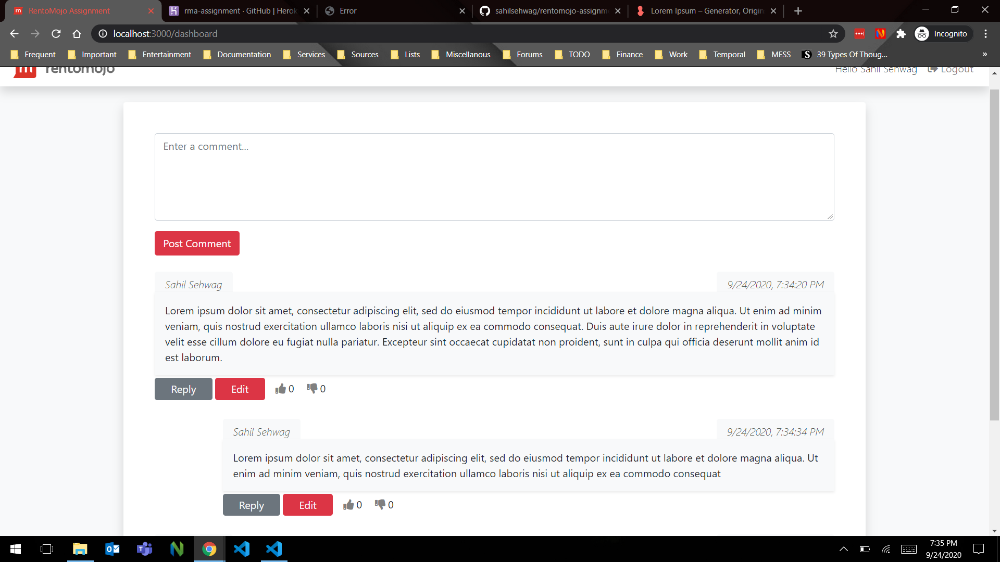

# RENTOMOJO Assignment

Commenting System similar to that Hacker News in MERN Stack



## Installing Packages & Running Project

Follow these commands exactly to run this project.

```sh
npm install
cd client
npm install
cd ..
npm run dev
```

**You need to run "npm install" in _client directory as well as global project directory_**

## Scripts Available

```sh
"scripts": {
	"start": "node app.js",
	"client": "npm start --prefix client",
	"server": "nodemon app.js",
	"dev": "concurrently \"npm run server\" \"npm run client\""
}

```

```sh
npm start
```

1. **npm start :** Runs the backend of app in the development mode at http://localhost:5000

```sh
npm run client
```

2. **npm run client :** Runs the frontend of app in the development mode at http://localhost:3000

```sh
npm run server
```

3. **npm run server :** Runs the backend of app in the development mode by nodemon at http://localhost:5000

## Running Project in Development Mode

```sh
npm run dev
```

Runs the app in the development mode, which run both backend and front server consecutively.
